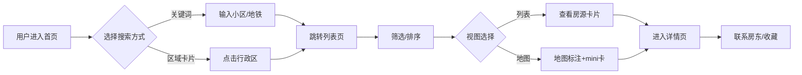

## 1. 产品概述

**觅巢** 是一款专注天津市场的租房聚合平台，汇聚贝壳 / 链家 / 自如 / 58 同城 / 安居客等多家平台房源，并重点扶持"个人房东直租"通道。解决天津租房者「多平台比价信息分散、中介费高、虚假房源多」三大痛点。

- **目标用户**：在津工作求学的年轻租客、新天津人、津漂白领；以及有闲置房产直租的个人房东
- **市场价值**：以"聚合 + 直租"双轮驱动，把租房决策时间从平均 2 周缩短至 3 天，中介费支出对租客降至 0（直租房源）

## 2. 核心功能

### 2.1 用户角色

| 角色 | 注册方式 | 核心权限 |
|------|----------|----------|
| 租客 | 手机号 / 微信 | 浏览、筛选、收藏、对比、订阅、联系房东 |
| 个人房东 | 实名认证 | 发布直租房源、管理房源、查看浏览数据 |

### 2.2 功能模块

1. **首页**：智能搜索、热门区域快捷入口、精选房源、当月价格行情、个人房东直租推荐
2. **房源列表页**：多维筛选 + 排序 + 虚拟滚动列表 + 列表/地图视图切换
3. **房源详情页**：图片轮播、房屋信息、配套设施、地图位置、周边配套、同小区在售
4. **地图找房**：基于 Leaflet 的天津地图，房源点聚合，行政区/地铁线切换
5. **数据看板**：天津各区均价、12 个月租金走势、热门小区排行、户型分布
6. **收藏夹**：localStorage 持久化收藏夹
7. **发布房源**：个人房东直租发布入口

### 2.3 页面详情

| 页面 | 模块 | 功能描述 |
|------|------|----------|
| 首页 | Hero 搜索 | 区域 / 地铁 / 小区关键词搜索，热门搜索词芯片 |
| 首页 | 热门区域 | 天津 16 行政区快捷入口卡片，按市内六区 / 环城四区 / 远郊分组 |
| 首页 | 精选房源 | 6 张精选房源卡片，含图片 / 价格 / 户型 / 来源标签 |
| 首页 | 价格行情 | 当月天津均价、环比涨跌、Top5 热门区域排行 |
| 首页 | 房东直租 | 横滑卡片，"房东直租"徽标高亮 |
| 列表页 | 筛选条 | 区域、价格、户型、朝向、地铁、来源平台、是否直租 |
| 列表页 | 排序条 | 综合 / 价格↑ / 价格↓ / 面积 / 最新 |
| 列表页 | 视图切换 | 列表视图 ↔ 地图视图，状态保留 |
| 详情页 | 图片轮播 | 大图 + 缩略图，键盘左右切换 |
| 详情页 | 基本信息 | 标题 / 价格 / 押付方式 / 户型 / 面积 / 朝向 / 楼层 |
| 详情页 | 配套设施 | WiFi / 空调 / 洗衣机 / 冰箱等图标列表 |
| 详情页 | 地图位置 | 小区位置 + 周边 1km 配套 POI |
| 详情页 | 同小区在售 | 同小区其他房源横向滚动 |
| 地图找房 | 地图主体 | Leaflet 地图，房源点聚合，价格气泡标注 |
| 地图找房 | 筛选浮层 | 价格 / 户型 / 是否直租 |
| 数据看板 | 区域均价 | 16 区均价横向柱状图 |
| 数据看板 | 走势曲线 | 12 个月租金走势折线图 |
| 数据看板 | 户型分布 | 一居 / 两居 / 三居 + 占比饼图 |
| 收藏夹 | 收藏列表 | 卡片列表，支持取消收藏、清空 |
| 发布房源 | 表单 | 小区 / 户型 / 面积 / 租金 / 押付 / 联系方式 / 图片上传 |

## 3. 核心流程

**搜索 → 联系房东主流程**：用户进入首页 → 输入关键词或选区域 → 跳转列表页 → 筛选 / 排序 → 进入详情 → 查看配套与位置 → 联系房东

**地图找房流程**：进入地图 → 拖动 / 缩放 → 自动加载可视区域房源 → 点击标注查看 mini 卡片 → 进入详情

**直租发布流程**：房东进入发布页 → 填写表单 → 实名校验 → 提交 → 在个人中心管理

## 4. 用户界面设计

### 4.1 设计风格

**美学定位：编辑杂志感 + 温暖现代主义**，区别于贝壳 / 链家的"工具感蓝色"，强调"觅巢 = 找家"的温度叙事。

- **主色**：暖橙 `#FF5516`（家的温度），辅色：墨炭 `#1A1A2E`（沉稳文本）、薄荷 `#00D9A6`（积极信号 / 直租徽标）
- **背景**：米白 `#FAF8F5` 取代纯白，营造纸张温度；深色模式 charcoal-900
- **字体**：
  - 中文标题：`Noto Serif SC`（思源宋体，编辑感）
  - 中文正文：`PingFang SC` / `Noto Sans SC`
  - 拉丁数字：`Fraunces`（变量衬线，价格 / 统计数字有故事感）
- **按钮**：圆角 12px、轻投影、悬浮微抬升 2px
- **卡片**：圆角 16px、1px 细描边、悬浮阴影渐显
- **布局**：响应式栅格，桌面 12 列，移动单列 + 底部导航
- **图标**：`lucide-react` 线性图标 + 自定义 SVG 房源标注

### 4.2 页面设计概览

| 页面 | 模块 | UI 元素 |
|------|------|---------|
| 首页 | Hero | 米白背景 + 大号宋体标题"在天津，找到属于你的巢"+ 居中搜索框 + 热门词芯片 |
| 首页 | 精选房源 | 3 列卡片网格，封面图占 60%，价格用 Fraunces 大字号 |
| 列表页 | 筛选条 | 顶部 sticky，横向滚动芯片，激活态填充暖橙 |
| 列表页 | 卡片 | 左图右文，悬浮抬升 + 投影 |
| 详情页 | 主图 | 12 列网格，左 7 列大图轮播，右 5 列信息面板 |
| 地图找房 | 全屏地图 | 左 1/4 浮层筛选，地图占主体，价格气泡标注 |
| 数据看板 | 图表 | recharts + 暖橙主色 + 宋体数字标签 |

### 4.3 响应式

- 桌面优先（≥1280px）：12 列栅格，多列卡片
- 平板（768-1024px）：2 列卡片，侧栏折叠为浮层
- 移动端（<768px）：单列 + 底部 Tab 导航（首页 / 地图 / 看板 / 收藏 / 我的）

### 4.4 动效

- 页面进场：`fade-in` + `slide-up` 0.5s spring
- 卡片悬浮：scale(1.02) + shadow 加深
- 列表项 stagger：相邻 50ms 延迟
- 数字滚动：`count-up` 1.5s 缓动
- 地图标注：`scale-in` 弹性进场
