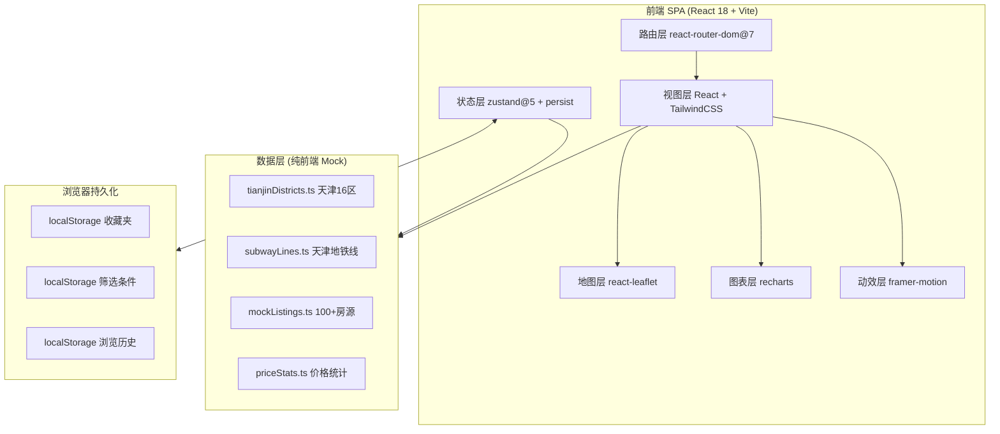

## 1. 架构设计



纯前端 SPA，无后端依赖。所有房源数据为 Mock，收藏 / 筛选 / 历史通过 zustand `persist` 中间件写入 `localStorage`。

## 2. 技术描述

- **前端框架**：React@18 + TypeScript@5 + Vite@6
- **样式方案**：TailwindCSS@3 + `clsx` + `tailwind-merge`（封装为 `cn()` helper）
- **路由**：react-router-dom@7（`createBrowserRouter` + 嵌套路由）
- **状态管理**：zustand@5 + `persist` 中间件
- **地图**：leaflet@1.9 + react-leaflet@4.2（OpenStreetMap 瓦片）
- **图表**：recharts@2.15
- **动画**：framer-motion@11（页面切换 / 卡片进场 / 抽屉）
- **虚拟滚动**：@tanstack/react-virtual@3（长列表性能）
- **图标**：lucide-react@0.511
- **数据**：纯前端 mock，无外部 API
- **字体**：Noto Serif SC + Noto Sans SC + Fraunces（Google Fonts）

## 3. 路由定义

| 路由 | 页面 | 布局 | 说明 |
|------|------|------|------|
| `/` | 首页 Home | 主布局 | Hero 搜索 + 精选 + 行情 |
| `/list` | 房源列表 Listing | 主布局 | 支持查询参数 `?district=&price=&roomType=&direct=&q=&sort=&view=` |
| `/list/:id` | 房源详情 Detail | 主布局 | 详情 + 地图 + 同小区 |
| `/map` | 地图找房 MapView | 全屏布局 | 全屏地图 + 浮层筛选 |
| `/insights` | 数据看板 Insights | 主布局 | 多图表组合 |
| `/favorites` | 收藏夹 Favorites | 主布局 | 本地收藏列表 |
| `/publish` | 发布房源 Publish | 主布局 | 个人房东直租表单 |
| `*` | 404 NotFound | 空布局 | 友好提示 + 回首页 |

## 4. 目录结构

```
src/
├── main.tsx                      # 应用入口
├── App.tsx                       # 根组件 + RouterProvider
├── router/
│   └── index.tsx                 # 路由配置 + Layout
├── pages/                        # 7 个页面
│   ├── Home.tsx
│   ├── Listing.tsx
│   ├── Detail.tsx
│   ├── MapView.tsx
│   ├── Insights.tsx
│   ├── Favorites.tsx
│   └── Publish.tsx
├── components/
│   ├── layout/
│   │   ├── Header.tsx            # 顶部导航 + 搜索
│   │   ├── Footer.tsx
│   │   └── BottomNav.tsx         # 移动端底部 Tab
│   ├── home/
│   │   ├── HeroSearch.tsx
│   │   ├── HotDistricts.tsx
│   │   ├── FeaturedListings.tsx
│   │   ├── PriceBoard.tsx
│   │   └── DirectRentStrip.tsx
│   ├── listing/
│   │   ├── ListingCard.tsx
│   │   ├── FilterBar.tsx
│   │   ├── SortBar.tsx
│   │   └── VirtualList.tsx
│   ├── map/
│   │   ├── MapContainer.tsx
│   │   ├── PriceMarker.tsx       # 自定义 DivIcon 价格气泡
│   │   └── MapFilterPanel.tsx
│   ├── charts/
│   │   ├── DistrictPriceChart.tsx
│   │   ├── TrendChart.tsx
│   │   └── RoomTypePie.tsx
│   ├── detail/
│   │   ├── ImageCarousel.tsx
│   │   ├── BasicInfo.tsx
│   │   ├── Facilities.tsx
│   │   ├── LocationMap.tsx
│   │   └── SameBlock.tsx
│   └── ui/                       # 通用 UI 原子组件
│       ├── Button.tsx
│       ├── Tag.tsx
│       ├── Sheet.tsx             # 底部抽屉
│       ├── Badge.tsx
│       └── EmptyState.tsx
├── store/
│   ├── favoritesStore.ts         # 收藏夹 (persist)
│   ├── filterStore.ts            # 筛选条件 (persist)
│   └── historyStore.ts           # 浏览历史 (persist, 最多50条)
├── data/
│   ├── tianjinDistricts.ts       # 16区 + 经纬度 + 均价
│   ├── subwayLines.ts            # 9条地铁线 + 站点
│   ├── mockListings.ts           # 100+ 条模拟房源
│   └── priceStats.ts             # 12个月走势 + 区域统计
├── types/
│   └── listing.ts                # Listing / District / Subway 类型
├── lib/
│   ├── utils.ts                  # cn() 类名合并
│   ├── format.ts                 # 价格/面积/时间格式化
│   └── constants.ts              # 来源平台标签/设施图标映射
└── styles/
    └── globals.css               # Tailwind base + 字体引入 + Leaflet 样式修正
```

## 5. 数据模型

### 5.1 类型定义

```typescript
// src/types/listing.ts

export type ListingSource = 'beike' | 'lianjia' | 'ziroom' | '58' | 'anju' | 'direct'

export interface Listing {
  id: string
  title: string
  cover: string
  images: string[]
  price: number                 // 月租金 元/月
  depositMode: string           // 押付方式 "押一付三"
  roomType: string              // "2室1厅1卫"
  area: number                  // 平方米
  orientation: string           // 朝向 "南"
  floor: string                 // "中楼层/共18层"
  district: string              // "南开"
  block: string                 // 小区名
  subway?: { line: string; station: string; walkMin: number }
  source: ListingSource
  isDirectRent: boolean
  landlord?: {
    name: string
    avatar: string
    verified: boolean
    responseRate: number        // %
  }
  facilities: string[]          // ['WiFi','空调','洗衣机','冰箱','电视','热水器']
  publishedAt: string           // ISO 时间
  coords: [number, number]      // [lat, lng] 天津市中心 ~ [39.13, 117.20]
  views: number
}

export interface TianjinDistrict {
  code: string
  name: string                  // "南开"
  group: 'inner' | 'suburb' | 'outer'  // 市内六区/环城四区/远郊
  avgPrice: number              // 元/月
  momChange: number             // 环比 %
  coords: [number, number]
  listingCount: number
}

export interface SubwayLine {
  id: string
  name: string                  // "3号线"
  color: string
  stations: { name: string; coords: [number, number] }[]
}

export interface PriceTrendPoint {
  month: string                 // "2025-08"
  avgPrice: number
  medianPrice: number
}
```

### 5.2 数据规模

- `mockListings.ts`：120 条房源，覆盖 16 区，价格区间 800–12000 元/月
- `tianjinDistricts.ts`：16 个行政区，含市内六区（和平/河东/河西/南开/河北/红桥）、环城四区（东丽/西青/津南/北辰）、远郊六区（武清/宝坻/滨海新区/宁河/静海/蓟州）
- `subwayLines.ts`：1/2/3/4/5/6/9/10 号线，共 200+ 站点
- `priceStats.ts`：12 个月走势 + 户型分布

## 6. 状态管理设计

```typescript
// 收藏夹
interface FavoritesState {
  ids: string[]
  toggle: (id: string) => void
  remove: (id: string) => void
  clear: () => void
  has: (id: string) => boolean
}

// 筛选条件（持久化，刷新保留）
interface FilterState {
  district?: string
  priceRange?: [number, number]
  roomTypes: string[]
  orientations: string[]
  subwayLine?: string
  sources: ListingSource[]
  directOnly: boolean
  sort: 'default' | 'price-asc' | 'price-desc' | 'area-desc' | 'latest'
  view: 'list' | 'map'
  keyword?: string
  setFilter: (patch: Partial<FilterState>) => void
  reset: () => void
}

// 浏览历史（最多 50 条）
interface HistoryState {
  ids: string[]
  push: (id: string) => void
  clear: () => void
}
```

## 7. 构建优化

沿用现有 [vite.config.ts](file:///workspace/vite.config.ts) 的 `manualChunks` 拆包策略：
- `vendor`: react / react-dom
- `router`: react-router-dom
- `ui`: lucide-react / framer-motion
- `charts`: recharts
- `maps`: leaflet / react-leaflet

地图与图表组件采用 `React.lazy` + `Suspense` 懒加载，避免首屏阻塞。
